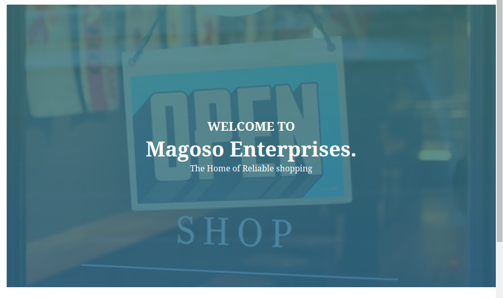

# MAGOSO ENTERPRISES
---
## Description
***
Magoso Deals with Enterprises for Different Items and  the Institution  Deals with DIfferent Activities Such as Disignining African Products of Different designs,Fashion Design,Modelling and Cultural Music.You Can also order a viriety of Products through Online and get them Through Free Delivery.


## Project Link 


You can view the live project [here]()
###Project ScreenShot
---


---

---

---


## Set Up an Installation
---
If you want to run this application in your computer,do the following;
- Clone the project to your desired locationn using this commmands-; 
 
 ```Git clone https://github.com/mosehkerubo/ecommerce.git```

 - Navigate to the Project directory using ```cd ecommerce```
 - Open the project using your favourite text editer eg in vsCode use```code .```
 - Install all the dependencies using```npm install``` (to use npm you must have [node](https://nodejs.org/en/) installed)
 - Run``` npm start```

 ## Technologies used
 ---
 -HTML 5
 -CSS 3
 -React router 6.0.2
 -react 17.0.2
 -MUI 5.1.0
 -Java script(es 6)
 -Node JS 16.13.0

 ### Known bugs
 Make sure you use the LTS version of node

 ### License
 ---

 
 MIT License

Copyright (c) [2021] **Moseh Kerubo**

Permission is hereby granted, free of charge, to any person obtaining a copy
of this software and associated documentation files (the "Software"), to deal
in the Software without restriction, including without limitation the rights
to use, copy, modify, merge, publish, distribute, sublicense, and/or sell
copies of the Software, and to permit persons to whom the Software is
furnished to do so, subject to the following conditions:

The above copyright notice and this permission notice shall be included in all
copies or substantial portions of the Software.

THE SOFTWARE IS PROVIDED "AS IS", WITHOUT WARRANTY OF ANY KIND, EXPRESS OR
IMPLIED, INCLUDING BUT NOT LIMITED TO THE WARRANTIES OF MERCHANTABILITY,
FITNESS FOR A PARTICULAR PURPOSE AND NONINFRINGEMENT. IN NO EVENT SHALL THE
AUTHORS OR COPYRIGHT HOLDERS BE LIABLE FOR ANY CLAIM, DAMAGES OR OTHER
LIABILITY, WHETHER IN AN ACTION OF CONTRACT, TORT OR OTHERWISE, ARISING FROM,
OUT OF OR IN CONNECTION WITH THE SOFTWARE OR THE USE OR OTHER DEALINGS IN THE
SOFTWARE.

####Contact Information
---
Incase of inquaries or bugs you can reach me on mosehkerubo@gmail.com

####Author
---
***Moseh Kerubo***


